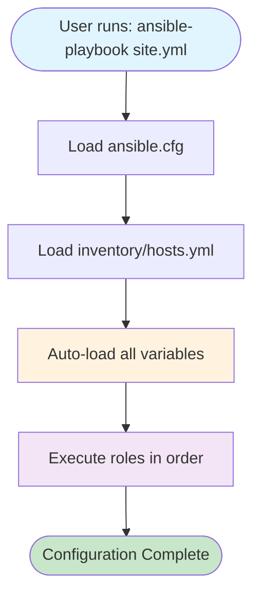
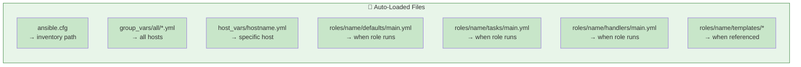
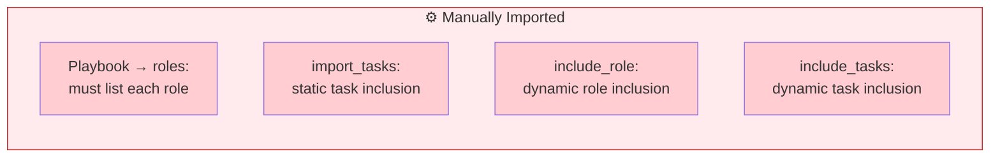
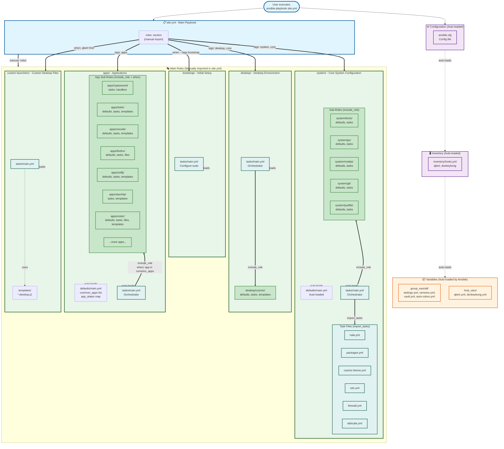
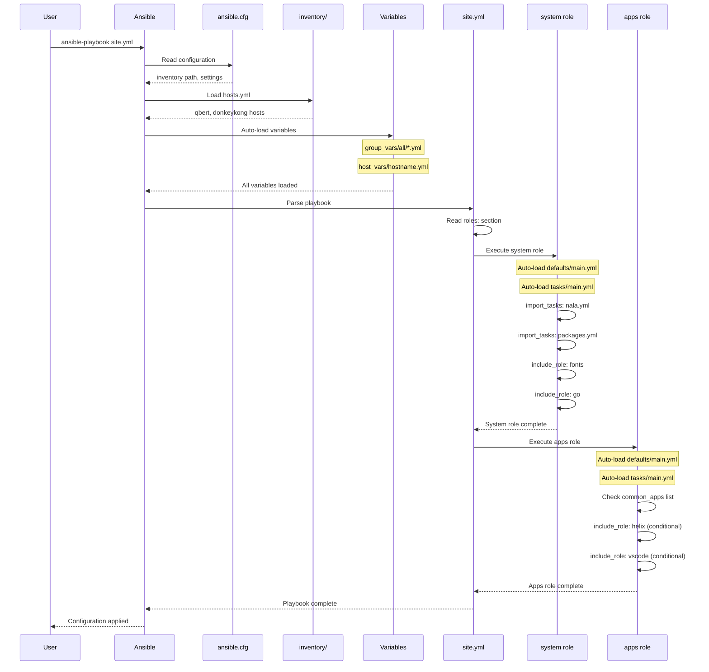

# Ansible Architecture and Code Flow

This document explains how the Ansible code is structured, how imports work (automatic vs manual), and what each folder is for. This will help you understand the repository and how Ansible works.

## Quick Overview

The Desktop Operator uses Ansible to configure Ubuntu desktop systems. The code is organized into:

- **Playbooks** - Entry points that orchestrate everything (`site.yml`, `bootstrap.yml`)
- **Inventory** - Defines which machines to configure
- **Roles** - Reusable configuration modules organized by purpose
- **Variables** - Configuration data that customizes the deployment

## High-Level Flow Diagram



## Auto-Import vs Manual Import

Understanding when Ansible automatically loads files versus when you need to explicitly import them is crucial.

### Auto-Import (Convention-Based) ✨

Ansible **automatically** loads these files based on naming conventions:



**Key Points:**
- No need to explicitly reference these files
- They load automatically when conditions are met
- Following Ansible naming conventions is critical

### Manual Import (Explicit Declaration) 📝

These require **explicit** references in your code:



**Key Differences:**
- `import_tasks` - Processed at parse time (static)
- `include_tasks` / `include_role` - Processed at runtime (dynamic, can use conditions)

## Complete Architecture Diagram



## Folder Structure and Purpose

### Root Level

```
desktoperator/
├── site.yml              # Main playbook - entry point for configuration
├── bootstrap.yml         # Bootstrap playbook - initial system setup
├── maintenance.yml       # Maintenance tasks playbook
├── security-check.yml    # Security validation playbook
├── ansible.cfg           # Ansible configuration (inventory path, etc)
└── justfile              # Task runner for common operations
```

**Purpose:**
- Playbooks live at the root for easy execution
- `ansible.cfg` configures Ansible behavior and paths

### inventory/

```
inventory/
├── hosts.yml             # Host definitions (qbert, donkeykong)
├── group_vars/
│   └── all/              # Variables for ALL hosts
│       ├── settings.yml      # User info, paths, settings
│       ├── versions.yml      # Pinned package versions
│       ├── vault.yml         # Encrypted secrets (Ansible Vault)
│       └── auto-colors.yml   # COSMIC theme colors
└── host_vars/
    ├── qbert.yml         # Host-specific variables for qbert
    └── donkeykong.yml    # Host-specific variables for donkeykong
```

**Purpose:**
- Define which machines to manage
- Store configuration variables
- **Auto-loaded** by Ansible based on hostname/group

**Auto-Import Behavior:**
- All files in `group_vars/all/` apply to every host
- Files in `host_vars/<hostname>.yml` apply to specific hosts
- Variables can override each other based on precedence

### roles/

The `roles/` directory contains all reusable Ansible roles. Each role is a self-contained unit of configuration.

#### Standard Role Structure

Each role can contain these folders (all are optional):

```
roles/role-name/
├── defaults/
│   └── main.yml          # Default variables (lowest precedence)
├── vars/
│   └── main.yml          # Role variables (higher precedence)
├── tasks/
│   └── main.yml          # Main tasks (auto-loaded)
├── handlers/
│   └── main.yml          # Event handlers (auto-loaded)
├── templates/
│   └── *.j2              # Jinja2 templates
├── files/
│   └── *                 # Static files
└── meta/
    └── main.yml          # Role metadata and dependencies
```

**Auto-Load Behavior:**
- When a role executes, Ansible **automatically** loads:
  - `defaults/main.yml`
  - `vars/main.yml`
  - `tasks/main.yml`
  - `handlers/main.yml`
- Templates and files are loaded **on-demand** when referenced

### roles/bootstrap/

```
roles/bootstrap/
└── tasks/
    └── main.yml          # Configure NOPASSWD sudo
```

**Purpose:**
- One-time initial system setup
- Only runs with `--tags bootstrap`
- Sets up passwordless sudo

### roles/system/

```
roles/system/
├── defaults/
│   └── main.yml          # Core package lists
├── tasks/
│   ├── main.yml          # Orchestrates all system tasks
│   ├── nala.yml          # Install nala package manager
│   ├── packages.yml      # Install core packages
│   ├── cosmic-theme.yml  # Extract COSMIC colors
│   ├── hostname.yml      # Set hostname
│   ├── users.yml         # User management
│   ├── python.yml        # Python packages
│   ├── flatpak.yml       # Flatpak setup
│   ├── fish.yml          # Fish shell config
│   ├── ssh.yml           # SSH configuration
│   ├── firewall.yml      # UFW firewall
│   └── tailscale.yml     # Tailscale VPN
├── fonts/                # Sub-role: Font installation
│   ├── defaults/main.yml
│   └── tasks/main.yml
├── go/                   # Sub-role: Go language
│   ├── defaults/main.yml
│   └── tasks/main.yml
├── nodejs/               # Sub-role: Node.js
│   ├── defaults/main.yml
│   └── tasks/main.yml
├── git/                  # Sub-role: Git configuration
│   ├── defaults/main.yml
│   ├── tasks/main.yml
│   └── templates/
├── justfile/             # Sub-role: Just task runner
│   ├── defaults/main.yml
│   ├── tasks/main.yml
│   └── templates/
└── templates/            # System-level templates
```

**Purpose:**
- Core system configuration
- Package management
- System services
- Development tools

**Import Pattern:**
- `tasks/main.yml` is the orchestrator
- Uses `import_tasks:` for task files in same directory
- Uses `include_role:` for sub-roles (nested roles)

**Why import_tasks vs include_role?**
- `import_tasks`: For simple task files without their own defaults/templates
- `include_role`: For complete sub-roles with their own defaults/templates/tasks

### roles/desktop/

```
roles/desktop/
├── tasks/
│   └── main.yml          # Desktop orchestrator
└── cosmic/               # Sub-role: COSMIC desktop
    ├── defaults/main.yml
    ├── tasks/main.yml
    └── templates/
```

**Purpose:**
- Desktop environment configuration
- Currently focused on COSMIC desktop

### roles/apps/

```
roles/apps/
├── defaults/
│   └── main.yml          # common_apps list, app_states
├── tasks/
│   └── main.yml          # App orchestrator with conditionals
├── 1password/            # Sub-role: 1Password
│   ├── tasks/main.yml
│   └── handlers/main.yml
├── helix/                # Sub-role: Helix editor
│   ├── defaults/main.yml
│   ├── tasks/main.yml
│   └── templates/
├── vscode/               # Sub-role: VS Code
│   ├── defaults/main.yml
│   ├── tasks/main.yml
│   └── templates/
├── firefox/              # Sub-role: Firefox
│   ├── defaults/main.yml
│   ├── tasks/main.yml
│   └── files/
├── zellij/               # Sub-role: Zellij
│   ├── defaults/main.yml
│   ├── tasks/main.yml
│   └── templates/
├── restic/               # Sub-role: Restic backups
│   ├── defaults/main.yml
│   ├── tasks/main.yml
│   ├── files/
│   └── templates/
└── ...                   # More apps
```

**Purpose:**
- Application installation and configuration
- Each app is a separate sub-role
- Conditional installation based on `common_apps` list

**Import Pattern:**
- `tasks/main.yml` uses `include_role` with `when:` conditions
- Each app only installs if listed in `common_apps` or `app_states`

**Example from apps/tasks/main.yml:**
```yaml
- name: Include Helix editor installation
  include_role:
    name: apps/helix
  tags: [helix, editor]
  when: "'helix' in common_apps or app_states['helix'] is defined"
```

### roles/custom-launchers/

```
roles/custom-launchers/
├── defaults/
│   └── main.yml
├── tasks/
│   └── main.yml          # Create desktop launcher files
└── templates/
    ├── reboot-windows.desktop.j2
    └── reboot-firmware.desktop.j2
```

**Purpose:**
- Custom desktop launcher shortcuts
- Host-specific (only runs on qbert)

## Execution Flow Example

Let's trace what happens when you run `ansible-playbook site.yml`:



## Key Concepts

### 1. Role Defaults vs Vars

```
defaults/main.yml    # Low precedence, easily overridden
vars/main.yml        # High precedence, harder to override
```

Use `defaults/` for values you expect users to customize.
Use `vars/` for values that should rarely change.

### 2. Nested Roles

This project uses nested roles (e.g., `apps/helix/`) instead of flat roles.

**Important:** Always use `include_role` for nested roles:

```yaml
# ✅ Correct - properly resolves templates/files
- include_role:
    name: apps/helix

# ❌ Wrong - templates/files won't resolve correctly
- import_tasks: ../helix/tasks/main.yml
```

### 3. Conditional Execution

Apps use conditional installation:

```yaml
# In apps/defaults/main.yml
common_apps:
  - helix
  - vscode
  - firefox

# In apps/tasks/main.yml
- include_role:
    name: apps/helix
  when: "'helix' in common_apps"
```

Override in `host_vars/hostname.yml` for host-specific apps.

### 4. Tags

Control execution with tags:

```bash
# Run only system configuration
ansible-playbook site.yml --tags system

# Run only VSCode installation
ansible-playbook site.yml --tags vscode

# Run everything except bootstrap
ansible-playbook site.yml --skip-tags bootstrap
```

### 5. Handlers

Handlers run once at the end of a play, even if notified multiple times:

```yaml
# In tasks/main.yml
- name: Update config file
  template:
    src: config.j2
    dest: /etc/app/config
  notify: restart service

# In handlers/main.yml
- name: restart service
  service:
    name: myapp
    state: restarted
```

## Variable Precedence

From lowest to highest priority:

1. `roles/*/defaults/main.yml` - Role defaults
2. `inventory/group_vars/all/*.yml` - Group variables (all hosts)
3. `inventory/host_vars/<hostname>.yml` - Host-specific variables
4. `roles/*/vars/main.yml` - Role variables
5. Playbook `vars:` section
6. Extra vars (`ansible-playbook -e "var=value"`)

## Common Patterns

### Pattern 1: Orchestrator Role

A main role that includes many sub-roles:

```yaml
# roles/apps/tasks/main.yml
---
- name: Include app 1
  include_role:
    name: apps/app1
  when: "'app1' in common_apps"

- name: Include app 2
  include_role:
    name: apps/app2
  when: "'app2' in common_apps"
```

### Pattern 2: Task File Organization

Breaking up large task files:

```yaml
# roles/system/tasks/main.yml
---
- name: Import package management
  import_tasks: packages.yml

- name: Import SSH configuration
  import_tasks: ssh.yml

- name: Include sub-role
  include_role:
    name: system/fonts
```

### Pattern 3: State Management

Apps support installation/removal:

```yaml
# In defaults/main.yml
app_state: present

# In tasks/main.yml
- name: Install package
  apt:
    name: myapp
    state: "{{ app_state }}"

# Override in host_vars/
app_state: absent  # Remove the app
```

## Tips for Navigation

1. **Start at playbooks** - `site.yml`, `bootstrap.yml`
2. **Check role task files** - `roles/*/tasks/main.yml` shows what the role does
3. **Look at defaults** - `roles/*/defaults/main.yml` shows configurable options
4. **Check templates** - `roles/*/templates/*.j2` shows what files are created
5. **Use tags** - `ansible-playbook site.yml --list-tasks --list-tags` shows all available tags

## Troubleshooting

### "Role not found" error
- Check if you're using `include_role` (not `import_tasks`) for nested roles
- Verify the role path in `ansible.cfg`: `roles_path = roles`

### "Template not found" error
- Ensure you used `include_role` (not `import_tasks`)
- Check that template is in `roles/name/templates/`

### Variables not applying
- Check variable precedence (host_vars > group_vars > defaults)
- Use `ansible-playbook site.yml -e "debug=yes"` to see variable values

### Tasks not running
- Check `when:` conditions
- Verify tags with `--tags` or `--skip-tags`
- Look for host-specific conditions

## Further Reading

- [Ansible Best Practices](https://docs.ansible.com/ansible/latest/user_guide/playbooks_best_practices.html)
- [Ansible Roles Documentation](https://docs.ansible.com/ansible/latest/playbook_guide/playbooks_reuse_roles.html)
- [Variable Precedence](https://docs.ansible.com/ansible/latest/playbook_guide/playbooks_variables.html#variable-precedence-where-should-i-put-a-variable)
- [Repository STRUCTURE.md](../STRUCTURE.md) - Detailed directory layout
- [Getting Started Guide](GETTING_STARTED.md) - How to use this repository
