# Ansible Architecture and Code Flow

This document explains how the Ansible repository is structured, how code flows through the system, and how imports work. It uses examples to illustrate concepts rather than documenting every file.

## Understanding Ansible Flow

When you run `ansible-playbook site.yml`, here's what happens:

```mermaid
flowchart TB
    Start([Run: ansible-playbook site.yml])
    Config[1. Load ansible.cfg<br/>Sets inventory path and defaults]
    Inventory[2. Load inventory/hosts.yml<br/>Determines which hosts to configure]
    Variables[3. Auto-load variables<br/>group_vars and host_vars]
    Playbook[4. Parse site.yml<br/>Read the roles to execute]
    Execute[5. Execute each role<br/>bootstrap → system → desktop → apps]
    Done([Configuration Applied])
    
    Start --> Config --> Inventory --> Variables --> Playbook --> Execute --> Done
    
    style Start fill:#e1f5ff
    style Done fill:#c8e6c9
    style Variables fill:#fff3e0
    style Execute fill:#f3e5f5
```



## Repository Structure

The repository follows Ansible's standard directory layout. Here's how it's organized:

```mermaid
graph TB
    subgraph Root["Repository Root"]
        direction TB
        Playbooks["📋 Playbooks<br/>site.yml, bootstrap.yml<br/><i>Entry points</i>"]
        Config["⚙️ ansible.cfg<br/><i>Configuration</i>"]
        Inventory["📁 inventory/<br/><i>Hosts and variables</i>"]
        Roles["📁 roles/<br/><i>Reusable configurations</i>"]
    end
    
    subgraph InventoryDetails["inventory/ Structure"]
        HostsFile["hosts.yml<br/><i>Host definitions</i>"]
        GroupVars["group_vars/all/<br/><i>Variables for all hosts</i>"]
        HostVars["host_vars/<hostname>.yml<br/><i>Host-specific variables</i>"]
    end
    
    subgraph RoleStructure["roles/ Structure<br/><i>Example: roles/system/</i>"]
        RoleTasks["tasks/main.yml<br/><i>What the role does</i>"]
        RoleDefaults["defaults/main.yml<br/><i>Default variables</i>"]
        RoleTemplates["templates/<br/><i>Config file templates</i>"]
        RoleHandlers["handlers/main.yml<br/><i>Actions triggered by changes</i>"]
    end
    
    Inventory --> InventoryDetails
    Roles --> RoleStructure
    
    style Root fill:#e8f5e9
    style InventoryDetails fill:#fff3e0
    style RoleStructure fill:#e1f5ff
```



## How Imports Work

Understanding automatic vs manual imports is key to understanding Ansible:

### Automatic Imports (Convention-Based)

Ansible automatically loads certain files based on their location and name:


**Key point**: If you follow Ansible's naming conventions, these files load automatically. No explicit import needed.

### Manual Imports (Explicit)

Some things must be explicitly declared:

```mermaid
graph LR
    subgraph Manual["⚙️ Must Be Explicitly Imported"]
        direction TB
        M1["Playbook → roles: (list each role)"]
        M2["import_tasks: (static)"]
        M3["include_role: (dynamic)"]
        M4["include_tasks: (dynamic)"]
    end
    
    style Manual fill:#ffebee,stroke:#c62828,stroke-width:2px
```



**Example - Manual import in site.yml:**
```yaml
roles:
  - role: system      # Must be explicitly listed
  - role: desktop     # Must be explicitly listed
  - role: apps        # Must be explicitly listed
```

## Folder Structure Explained

### Root Level Files

```
desktoperator/
├── site.yml              # Main playbook - lists roles to execute
├── ansible.cfg           # Configuration - sets inventory path
└── inventory/            # Host definitions and variables
```

**Purpose**: Entry points and configuration

### inventory/ Folder

```
inventory/
├── hosts.yml             # Defines hosts (e.g., qbert, donkeykong)
├── group_vars/
│   └── all/              # Variables that apply to ALL hosts
│       ├── settings.yml
│       └── vault.yml     # Encrypted secrets
└── host_vars/
    └── qbert.yml         # Variables specific to one host
```

**Purpose**: Define which machines to manage and their configuration

**Auto-loading**: Ansible automatically loads all files in `group_vars/all/` for every host, and `host_vars/<hostname>.yml` for specific hosts.

### roles/ Folder

Each role is a folder containing related configuration tasks. Example: `roles/system/`

```
roles/system/
├── tasks/
│   ├── main.yml          # Auto-loaded when role runs
│   ├── packages.yml      # Imported by main.yml
│   └── ssh.yml           # Imported by main.yml
├── defaults/
│   └── main.yml          # Auto-loaded default variables
├── templates/
│   └── config.j2         # Referenced in tasks
└── fonts/                # Sub-role (nested)
    ├── tasks/main.yml
    └── defaults/main.yml
```

**Role Structure (Standard Folders)**:
- `tasks/` - What the role does (main.yml is auto-loaded)
- `defaults/` - Default variables (main.yml is auto-loaded)
- `templates/` - Jinja2 templates for config files
- `handlers/` - Actions triggered by changes (main.yml is auto-loaded)
- `files/` - Static files to copy
- Sub-folders like `fonts/`, `nodejs/` - Nested sub-roles

## Code Flow Example

Let's trace how the `system` role executes:


**What's happening**:
1. `site.yml` manually lists `system` in its `roles:` section
2. Ansible auto-loads `roles/system/defaults/main.yml` and `roles/system/tasks/main.yml`
3. `tasks/main.yml` uses `import_tasks:` to include task files in the same directory
4. `tasks/main.yml` uses `include_role:` to include sub-roles like `fonts/`

## Pattern: Nested Roles

This repository uses nested roles (e.g., `roles/apps/helix/`, `roles/system/fonts/`).

**Example - apps role structure:**
```
roles/apps/
├── tasks/main.yml        # Orchestrator - includes sub-roles
├── defaults/main.yml     # List of apps to install
├── helix/                # Sub-role for Helix editor
│   ├── tasks/main.yml
│   ├── defaults/main.yml
│   └── templates/
├── vscode/               # Sub-role for VS Code
│   ├── tasks/main.yml
│   └── templates/
└── firefox/              # Sub-role for Firefox
    └── tasks/main.yml
```

**How it works:**
- `roles/apps/tasks/main.yml` conditionally includes each app sub-role
- Each app is self-contained in its own folder
- Apps only install if listed in the `common_apps` variable

**Example from apps/tasks/main.yml:**
```yaml
- name: Include Helix editor installation
  include_role:
    name: apps/helix
  when: "'helix' in common_apps"
```

## Import Methods Comparison

| Method | When Processed | Can Use Conditions | Use Case |
|--------|----------------|-------------------|----------|
| `import_tasks` | Parse time (static) | No | Simple task files in same role |
| `include_tasks` | Runtime (dynamic) | Yes | Conditional task execution |
| `include_role` | Runtime (dynamic) | Yes | Sub-roles, conditional roles |

**Best Practice**: Use `include_role` for nested roles (like `apps/helix`) because it properly resolves templates and files.

## Key Concepts

### 1. Auto-Loading
Files named `main.yml` in specific folders are automatically loaded:
- `defaults/main.yml` - When role starts
- `tasks/main.yml` - When role starts
- `handlers/main.yml` - When role starts

### 2. Variable Precedence
Variables can be defined in multiple places. Priority (low to high):
1. `roles/*/defaults/main.yml` (lowest)
2. `group_vars/all/*.yml`
3. `host_vars/<hostname>.yml`
4. `roles/*/vars/main.yml`
5. Extra vars (`-e` on command line) (highest)

### 3. Conditional Execution
Use `when:` to control what runs:
```yaml
- include_role:
    name: apps/vscode
  when: "'vscode' in common_apps"
```

### 4. Tags
Control execution with tags:
```bash
ansible-playbook site.yml --tags system    # Only system role
ansible-playbook site.yml --tags vscode    # Only vscode app
```

## Practical Examples

### Example 1: Adding a New Role

To add a new role called `monitoring`:

1. Create folder: `roles/monitoring/`
2. Add `tasks/main.yml` (auto-loaded)
3. Add `defaults/main.yml` for variables (auto-loaded)
4. Add to `site.yml`:
```yaml
roles:
  - role: monitoring
```

### Example 2: Adding a New App

To add a new app to the apps role:

1. Create folder: `roles/apps/myapp/`
2. Add `tasks/main.yml`
3. Add to `roles/apps/defaults/main.yml`:
```yaml
common_apps:
  - myapp
```
4. Add to `roles/apps/tasks/main.yml`:
```yaml
- include_role:
    name: apps/myapp
  when: "'myapp' in common_apps"
```

### Example 3: Host-Specific Configuration

To configure something only for host "qbert":

**In `inventory/host_vars/qbert.yml`:**
```yaml
enable_special_feature: true
```

**In role task:**
```yaml
- name: Configure special feature
  template:
    src: special.conf.j2
    dest: /etc/special.conf
  when: enable_special_feature | default(false)
```

## Troubleshooting

**"Role not found"**
- Check the role is in `roles/` directory
- Verify you're using `include_role` (not `import_tasks`) for nested roles

**"Template not found"**
- Ensure you used `include_role` (not `import_tasks`)
- Check template is in `roles/<name>/templates/`

**"Variables not applying"**
- Check variable precedence (host_vars overrides group_vars)
- Use `ansible-inventory --host <hostname>` to see all variables for a host

## Further Reading

- [Ansible Best Practices](https://docs.ansible.com/ansible/latest/user_guide/playbooks_best_practices.html)
- [Understanding Variable Precedence](https://docs.ansible.com/ansible/latest/playbook_guide/playbooks_variables.html#variable-precedence-where-should-i-put-a-variable)
- [Repository STRUCTURE.md](../STRUCTURE.md) - Detailed file listing
- [Getting Started Guide](GETTING_STARTED.md) - How to use this repository
