# Desktop Operator - Ansible Architecture Diagram

This diagram shows how the Ansible repository is structured, including manual and automatic import relationships.

```mermaid
graph TB
    %% Style Definitions
    classDef playbook fill:#e1f5ff,stroke:#01579b,stroke-width:2px
    classDef inventory fill:#f3e5f5,stroke:#4a148c,stroke-width:2px
    classDef vars fill:#fff3e0,stroke:#e65100,stroke-width:2px
    classDef role fill:#e8f5e9,stroke:#1b5e20,stroke-width:2px
    classDef subrole fill:#c8e6c9,stroke:#2e7d32,stroke-width:2px
    classDef tasks fill:#e0f2f1,stroke:#004d40,stroke-width:2px
    classDef auto fill:#bbdefb,stroke:#0d47a1,stroke-width:2px,stroke-dasharray: 5 5
    classDef manual fill:#ffccbc,stroke:#bf360c,stroke-width:2px

    %% Playbooks (Entry Points)
    subgraph Playbooks ["📋 Playbooks (Entry Points)"]
        site[site.yml<br/>Main Configuration]
        bootstrap_pb[bootstrap.yml<br/>Initial Setup]
        maintenance[maintenance.yml<br/>System Updates]
        security[security-check.yml<br/>Pre-commit Validation]
    end

    %% Inventory
    subgraph Inventory ["🖥️ Inventory"]
        hosts[hosts.yml<br/>qbert, donkeykong]
    end

    %% Variables
    subgraph Variables ["⚙️ Variables (Auto-loaded)"]
        direction TB
        subgraph GroupVars ["group_vars/all/"]
            settings[settings.yml<br/>user, personal info]
            versions[versions.yml<br/>package versions]
            vault[vault.yml<br/>🔒 encrypted secrets]
            colors[auto-colors.yml<br/>theme colors]
        end
        subgraph HostVars ["host_vars/"]
            qbert_vars[qbert.yml<br/>host-specific config]
            dk_vars[donkeykong.yml<br/>host-specific config]
        end
    end

    %% Main Roles
    subgraph Roles ["🎭 Main Roles"]
        direction TB

        %% Bootstrap Role
        subgraph BootstrapRole ["bootstrap/"]
            bootstrap_tasks[tasks/main.yml<br/>sudo setup]
        end

        %% System Role
        subgraph SystemRole ["system/"]
            system_main[tasks/main.yml<br/>🎯 Orchestrator]
            system_defaults[defaults/main.yml<br/>core packages]

            subgraph SystemTasks ["Task Files (manual import)"]
                nala[nala.yml<br/>package manager]
                packages[packages.yml<br/>core packages]
                cosmic_theme[cosmic-theme.yml<br/>color extraction]
                ssh[ssh.yml<br/>SSH config]
                firewall[firewall.yml<br/>UFW setup]
                tailscale[tailscale.yml<br/>VPN]
            end

            subgraph SystemSubroles ["Sub-roles (manual import)"]
                fonts[system/fonts/<br/>font installation]
                go[system/go/<br/>Go language]
                nodejs[system/nodejs/<br/>Node.js]
                git[system/git/<br/>Git config]
                justfile[system/justfile/<br/>Just task runner]
            end
        end

        %% Desktop Role
        subgraph DesktopRole ["desktop/"]
            desktop_main[tasks/main.yml<br/>🎯 Orchestrator]
            cosmic[desktop/cosmic/<br/>COSMIC desktop config]
        end

        %% Apps Role
        subgraph AppsRole ["apps/"]
            apps_main[tasks/main.yml<br/>🎯 Orchestrator]
            apps_defaults[defaults/main.yml<br/>common_apps list]

            subgraph AppSubroles ["App Sub-roles (conditional)"]
                onepass[apps/1password/<br/>password manager]
                vscode[apps/vscode/<br/>code editor]
                firefox[apps/firefox/<br/>web browser]
                zen[apps/zen-browser/<br/>zen browser]
                zellij[apps/zellij/<br/>terminal multiplexer]
                helix[apps/helix/<br/>text editor]
                starship[apps/starship/<br/>prompt]
                terminal_exp[apps/terminal-experience/<br/>fzf, bat, etc.]
                slack[apps/slack/<br/>communication]
                restic[apps/restic/<br/>backups]
            end
        end

        %% Custom Launchers Role
        subgraph CustomLaunchersRole ["custom-launchers/"]
            launchers_main[tasks/main.yml<br/>desktop launchers]
            launchers_templates[templates/<br/>reboot scripts]
        end
    end

    %% Connections - Playbook to Inventory/Variables
    site -->|auto-loads| hosts
    bootstrap_pb -->|auto-loads| hosts
    site -->|auto-loads| Variables

    %% Connections - Inventory to Variables
    hosts -->|auto-loads| GroupVars
    hosts -->|auto-loads| HostVars

    %% Connections - Playbook to Roles (Manual)
    site ==>|"manual import<br/>(tags: bootstrap, never)"| BootstrapRole
    site ==>|"manual import<br/>(tags: system, core)"| SystemRole
    site ==>|"manual import<br/>(tags: desktop, core)"| DesktopRole
    site ==>|"manual import<br/>(tags: apps)"| AppsRole
    site ==>|"manual import<br/>(when: qbert only)"| CustomLaunchersRole

    %% Connections - System Role Auto-loads
    SystemRole -.->|auto-loads| system_defaults

    %% Connections - System Role Internal (Manual imports)
    system_main ==>|import_tasks| nala
    system_main ==>|import_tasks| packages
    system_main ==>|import_tasks| cosmic_theme
    system_main ==>|import_tasks| ssh
    system_main ==>|import_tasks| firewall
    system_main ==>|import_tasks| tailscale

    system_main ==>|include_role| fonts
    system_main ==>|include_role| go
    system_main ==>|include_role| nodejs
    system_main ==>|include_role| git
    system_main ==>|include_role| justfile

    %% Connections - Desktop Role
    desktop_main ==>|include_role| cosmic

    %% Connections - Apps Role Auto-loads
    AppsRole -.->|auto-loads| apps_defaults

    %% Connections - Apps Role Internal (Manual imports with conditions)
    apps_main ==>|"include_role<br/>(when: in common_apps)"| onepass
    apps_main ==>|"include_role<br/>(when: in common_apps)"| vscode
    apps_main ==>|"include_role<br/>(when: in common_apps)"| firefox
    apps_main ==>|"include_role<br/>(when: in common_apps)"| zen
    apps_main ==>|"include_role<br/>(when: in common_apps)"| zellij
    apps_main ==>|"include_role<br/>(when: in common_apps)"| helix
    apps_main ==>|"include_role<br/>(when: in common_apps)"| starship
    apps_main ==>|"include_role<br/>(when: in common_apps)"| terminal_exp
    apps_main ==>|"include_role<br/>(when: in common_apps)"| slack
    apps_main ==>|"include_role<br/>(when: in common_apps)"| restic

    %% Connections - Custom Launchers Role
    launchers_main -.->|uses| launchers_templates

    %% Apply Styles
    class site,bootstrap_pb,maintenance,security playbook
    class hosts inventory
    class settings,versions,vault,colors,qbert_vars,dk_vars vars
    class SystemRole,DesktopRole,AppsRole,BootstrapRole,CustomLaunchersRole role
    class fonts,go,nodejs,git,justfile,cosmic,onepass,vscode,firefox,zen,zellij,helix,starship,terminal_exp,slack,restic subrole
    class system_main,desktop_main,apps_main,bootstrap_tasks,launchers_main,nala,packages,cosmic_theme,ssh,firewall,tailscale tasks

    %% Legend
    subgraph Legend ["📖 Legend"]
        direction LR
        auto_line[Auto-loaded] -.->|dotted line| auto_ex[Convention-based]
        manual_line[Manual import] ==>|solid line| manual_ex[Explicitly defined]
    end

    class auto_line,auto_ex auto
    class manual_line,manual_ex manual
```



## Key Relationships

### Auto-Import (Convention-based) - Dotted Lines

These are automatically loaded by Ansible conventions:

1. **Playbook → Inventory**: `ansible.cfg` specifies `inventory = inventory/hosts.yml`
2. **Playbook → Variables**: Ansible automatically loads:
   - `group_vars/all/*.yml` for all hosts
   - `group_vars/<group>/*.yml` for group members
   - `host_vars/<hostname>.yml` for specific hosts
3. **Role → defaults/main.yml**: Auto-loaded when role executes
4. **Role → tasks/main.yml**: Auto-loaded when role executes
5. **Role → handlers/main.yml**: Auto-loaded when role executes

### Manual Import (Explicit) - Solid Lines

These require explicit declaration in playbooks or task files:

1. **Playbook → Roles**: Must be listed in playbook's `roles:` section
2. **import_tasks**: Static task file inclusion (parsed at load time)
   - Used in `system/tasks/main.yml` to break up large task files
   - Example: `import_tasks: nala.yml`
3. **include_role**: Dynamic role inclusion (parsed at runtime)
   - Used in `system/tasks/main.yml` for sub-roles
   - Used in `apps/tasks/main.yml` for conditional app installation
   - Example: `include_role: name: apps/vscode`

## Execution Flow

```
1. Run: ansible-playbook site.yml
2. Load: ansible.cfg → inventory/hosts.yml
3. Load: All variables (group_vars, host_vars) automatically
4. Execute roles in order:
   ├─ bootstrap (only with --tags bootstrap)
   ├─ system
   │  ├─ Load defaults/main.yml automatically
   │  ├─ Execute tasks/main.yml
   │  │  ├─ import_tasks: nala.yml, packages.yml, etc.
   │  │  └─ include_role: fonts, go, nodejs, etc.
   ├─ desktop
   │  └─ include_role: desktop/cosmic
   ├─ apps
   │  ├─ Load defaults/main.yml (common_apps list)
   │  └─ Conditionally include_role: 1password, vscode, etc.
   └─ custom-launchers (only for qbert host)
```

## Conditional Execution

- **Tags**: Control which roles/tasks run
  - `--tags system` - Only system role
  - `--tags vscode` - Only VSCode installation
- **Host conditions**: `when: inventory_hostname == 'qbert'`
- **App conditions**: `when: "'vscode' in common_apps"`

## Variable Precedence (Lowest → Highest)

1. `roles/*/defaults/main.yml` (role defaults)
2. `inventory/group_vars/all/*.yml` (global)
3. `inventory/host_vars/<host>.yml` (host-specific)
4. `roles/*/vars/main.yml` (role vars)
5. Extra vars (`-e` command-line)
